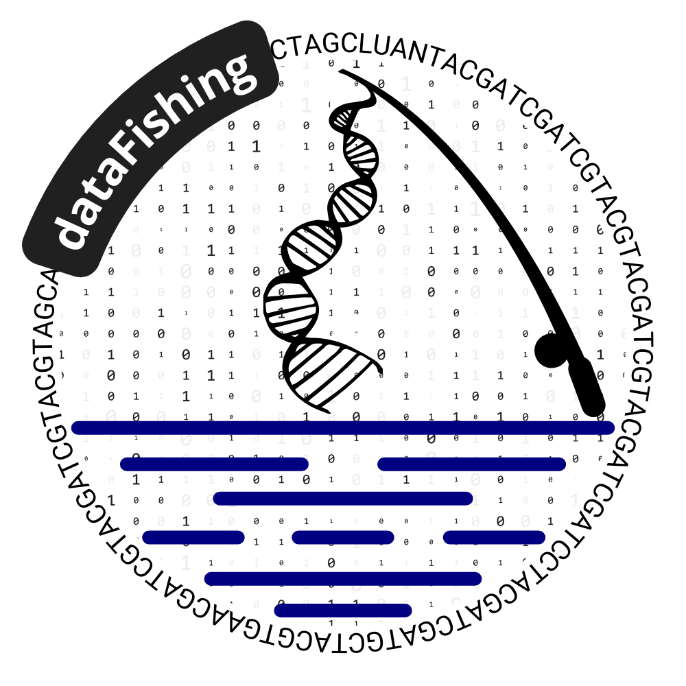
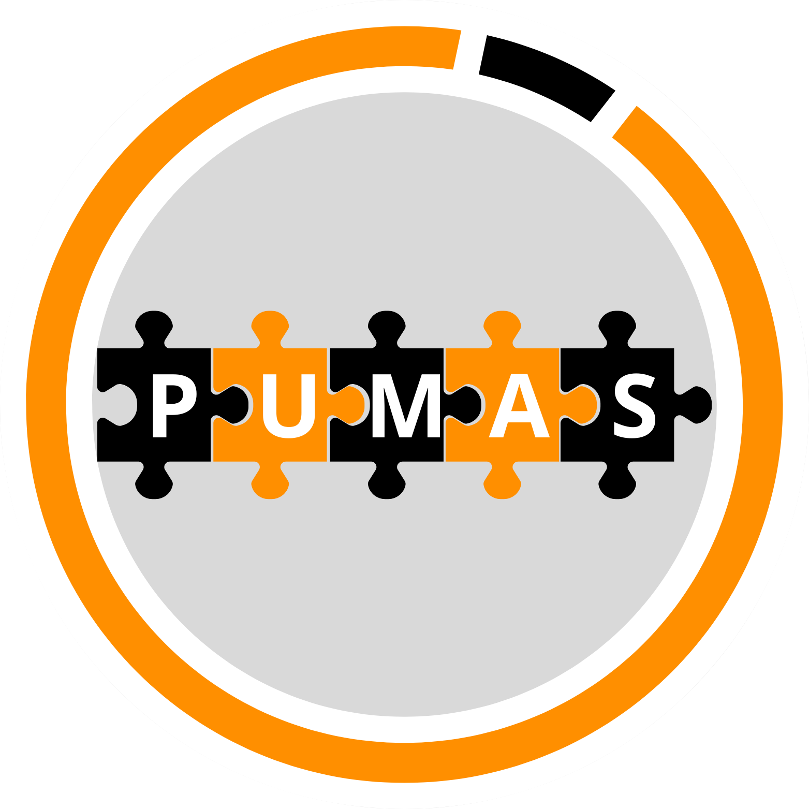

# Development and Application of Computational Technologies in Bioinformatics for Teaching and Research in Genetics and Evolution

#### Author: Luan Pinto **Rabelo**

# Contents Overview
- [Thesis Overview](#thesis-overview)
    - [Download Thesis](#download-thesis)
    - [Audio Description of the Thesis](#audio-description-of-the-thesis) For visually impaired readers
- [Thesis Chapter 2: SynGenes](#thesis-chapter-2-syngenes)
- [Thesis Chapter 3: SyBA](#thesis-chapter-3-syba)
- [Thesis Chapter 4: dataFishing](#thesis-chapter-4-datafishing)
- [Thesis Chapter 5: PUMAS](#thesis-chapter-5-pumas)
- [Thesis Chapter 6: ForAlexa](#thesis-chapter-6-foralexa)
***

# Thesis Overview
This thesis explores the development and implementation of computational technologies in the field of bioinformatics, with a particular emphasis on their applications in genetics, biodiversity, and evolutionary studies. The research encompasses the creation of an educational web platform integrated with Alexa artificial intelligence, aimed at enhancing teaching initiatives, as well as the development of a Python-based application for the analysis of genetic and biodiversity data. **The thesis and all published articles include audio descriptions for accessibility purposes, ensuring inclusive access to the research content.**

**This work is competing for the PRÊMIO JOVEM GENETICISTA 2025 - FRANCISCO MAURO SALZANO.** <a href="https://raw.githubusercontent.com/luanrabelo/bioinformatics-phd-thesis/stable/assets/premio_audio_description.wav" download="Premio_Audio_Description.wav" target="_blank">🔊 Audio Description</a>

## Download Thesis
You can download the thesis in PDF format from the following link: <a href="https://raw.githubusercontent.com/luanrabelo/bioinformatics-phd-thesis/stable/assets/thesis.pdf" download="Thesis.pdf" target="_blank">Download Thesis</a>

## Audio Description of the Thesis
An audio description of the thesis is available for **visually impaired readers**. The audio description can be accessed here: <a href="https://raw.githubusercontent.com/luanrabelo/bioinformatics-phd-thesis/stable/assets/thesis_audio_description.wav" download="Thesis_Audio_Description.wav" target="_blank">Audio Description</a>
***

# Thesis Chapter 2: SynGenes

  

**SynGenes** is one of the tools developed in the thesis to address the critical problem of **non-standardized gene nomenclature**. The lack of standardization severely compromises the efficiency of searches in databases like GenBank and PubMedCentral, as well as the accuracy of evolutionary and phylogenetic analyses.

| Resource Type | Description | Link | Audio Description |
|---------------|-------------|------|-------------------|
| **🐍 Python Class** | Complete implementation for programmatic use | <a href="https://github.com/luanrabelo/SynGenes" target="_blank">📁 SynGenes GitHub Repository</a> | - |
| **🌐 Web Form** | Intuitive interface for non-programmers | <a href="https://luanrabelo.github.io/SynGenes" target="_blank">🔗 SynGenes Web Form</a> | - |
| **📄 Scientific Article** | Published in BMC Bioinformatics | <a href="https://doi.org/10.1186/s12859-024-05781-y" target="_blank">📖 SynGenes in BMC Bioinformatics</a> | <a href="https://raw.githubusercontent.com/luanrabelo/bioinformatics-phd-thesis/stable/assets/syngenes_article_audio.wav" download="SynGenes_Article_Audio.wav" target="_blank">🔊 Audio Description</a> |
***

# Thesis Chapter 3: SyBA

  

**SyBA (Synonymous of Bacterial Genes)** is a tool developed to expand gene name standardization to **public health and food safety**. It addresses the critical problem of inconsistent bacterial gene nomenclature that can delay the identification of virulence or antibiotic resistance genes, with serious implications for public health.

| Resource Type | Description | Link | Audio Description |
|---------------|-------------|------|-------------------|
| **🐍 Python Class** | Complete implementation for programmatic use | <a href="https://github.com/luanrabelo/SyBA" target="_blank">📁 SyBA GitHub Repository</a> | - |
| **🌐 Web Form** | Intuitive interface for non-programmers | <a href="https://luanrabelo.github.io/SyBA/" target="_blank">🔗 SyBA Web Form</a> | - |
| **📄 Scientific Article** | Research manuscript (not yet published) | - | <a href="https://raw.githubusercontent.com/luanrabelo/bioinformatics-phd-thesis/stable/assets/syba_article_audio.wav" download="SyBA_Article_Audio.wav" target="_blank">🔊 Audio Description</a> |
***

# Thesis Chapter 4: dataFishing

  

**dataFishing** is a tool developed to address the complexity generated by the **fragmentation of genomic, taxonomic, and biodiversity data**. This information is scattered across multiple platforms such as BOLD Systems, GenBank, GBIF, IUCN, and World Register of Marine Species (WoRMS), making data collection a time-consuming and technically challenging process for researchers.

| Resource Type | Description | Link | Audio Description |
|---------------|-------------|------|-------------------|
| **🐍 Python Class** | Complete implementation for programmatic use | <a href="https://github.com/luanrabelo/dataFishing" target="_blank">📁 dataFishing GitHub Repository</a> | - |
| **🌐 Web Form** | Intuitive interface for non-programmers | <a href="https://luanrabelo.github.io/dataFishing/" target="_blank">🔗 dataFishing Web Form</a> | - |
| **📄 Scientific Article** | Published in Ecological Informatics | <a href="https://doi.org/10.1016/j.ecoinf.2024.102970" target="_blank">📖 dataFishing in BMC Ecological Informatics</a> | <a href="https://raw.githubusercontent.com/luanrabelo/bioinformatics-phd-thesis/stable/assets/datafishing_article_audio.wav" download="dataFishing_Article_Audio.wav" target="_blank">🔊 Audio Description</a> |
***

# Thesis Chapter 5: PUMAS

  

**PUMAS (Puzzle Mitochondrial and Chloroplast Analysis Script)** is an interactive web tool developed to visualize and compare gene orders across multiple organellar genomes. It addresses the complexity of analyzing gene arrangements due to non-standardized gene names and limitations of existing tools in allowing interactive edits for better interpretation of evolutionary events.

| Resource Type | Description | Link | Audio Description |
|---------------|-------------|------|-------------------|
| **🌐 Interactive Web Tool** | Complete web-based interface for genome visualization | <a href="https://luanrabelo.github.io/PUMAS/" target="_blank">🔗 PUMAS Web Tool</a> | - |
| **💻 Source Code** | HTML and JavaScript implementation | <a href="https://github.com/luanrabelo/PUMAS" target="_blank">📁 PUMAS GitHub Repository</a> | - |
| **📄 Scientific Article** | Research manuscript (not yet published) | - | <a href="https://raw.githubusercontent.com/luanrabelo/bioinformatics-phd-thesis/stable/assets/pumas_article_audio.wav" download="PUMAS_Article_Audio.wav" target="_blank">🔊 Audio Description</a> |
***

# Thesis Chapter 6: ForAlexa

  

**ForAlexa** is an online tool designed to address the difficulty faced by educators in creating digital teaching resources involving Artificial Intelligence (AI), specifically Skills for Amazon Alexa. It democratizes AI tool creation by enabling educators without programming experience to develop customized educational applications, contributing to **SDG 4 (Quality Education)** and creating more inclusive learning environments.

| Resource Type | Description | Link | Audio Description |
|---------------|-------------|------|-------------------|
| **🌐 Web Platform** | Complete online tool for Alexa Skills development | <a href="https://levo.ufpa.br/ForAlexa/" target="_blank">🔗 ForAlexa Web Platform</a> | - |
| **💻 Source Code** | Open-source implementation | <a href="https://github.com/luanrabelo/ForAlexa" target="_blank">📁 ForAlexa GitHub Repository</a> | - |
| **🎯 Population Genetics Skill** | Example Alexa Skill for undergraduate course | <a href="https://www.amazon.com.br/dp/B092G8B2YW" target="_blank">📱 Alexa Skill Store (Brazil)</a> | - |
| **📄 Scientific Article** | Published research (Rabelo et al. 2022) | - | <a href="https://raw.githubusercontent.com/luanrabelo/bioinformatics-phd-thesis/stable/assets/foralexa_article_audio.wav" download="ForAlexa_Article_Audio.wav" target="_blank">🔊 Audio Description</a> |

***