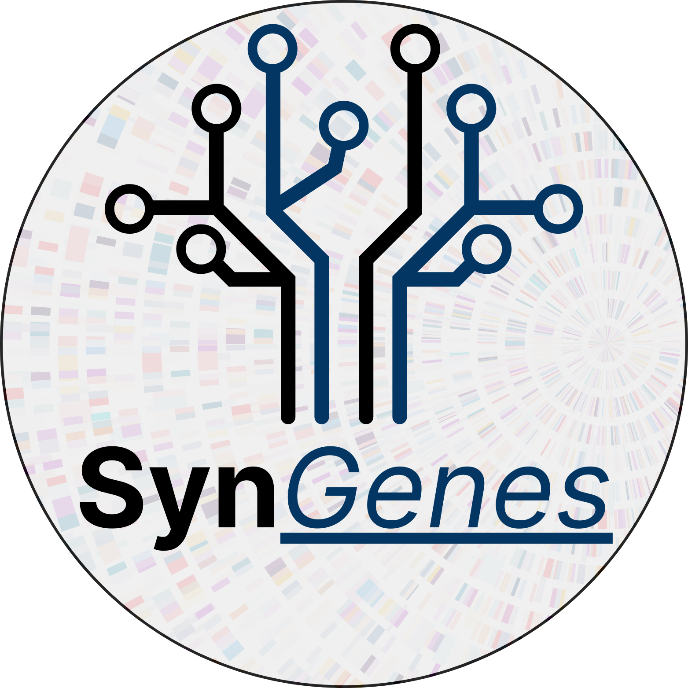

# Development and Application of Computational Technologies in Bioinformatics for Teaching and Research in Genetics and Evolution
### Author: Luan Pinto **Rabelo**

# Contents Overview
- [System Overview](#system-overview)
- [Thesis Overview](#thesis-overview)
    - [Download Thesis](#download-thesis)
    - [Audio Description of the Thesis](#audio-description-of-the-thesis) For visually impaired readers

# Thesis Overview
This thesis presents the development and application of computational technologies in bioinformatics, focusing on their use in teaching and research in genetics and evolution. The work includes the creation of a web platform for educational purposes, the development of a python application for genetic data analysis.

## Download Thesis
You can download the thesis in PDF format from the following link: [Download Thesis](assets/thesis.pdf)

## Audio Description of the Thesis
An audio description of the thesis is available for **visually impaired readers**. It provides an overview of the thesis content and its significance in the field of bioinformatics. The audio description can be accessed here: [Audio Description](assets/thesis_audio_description.wav)

  

